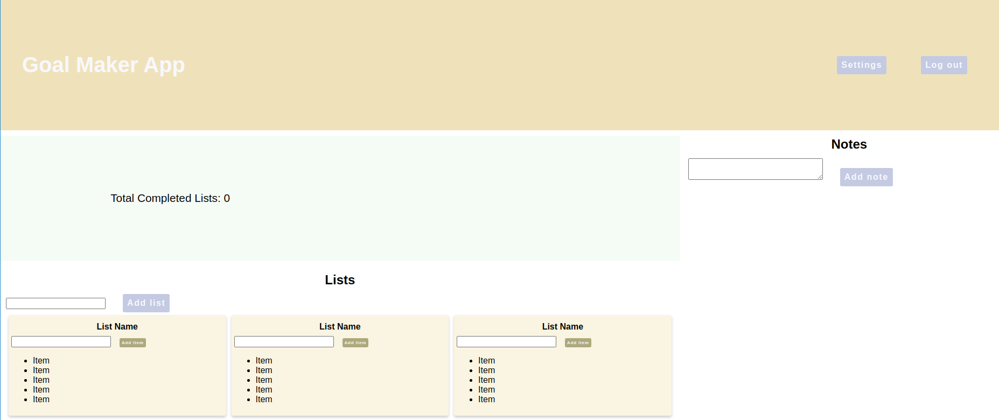

# Getting Started with the Goal Maker Project

## Setup

1. Fork and clone this repository.
2. Run the command `npm install`
3. After the installation process completes, you should be ready to code along and add functionality to the Goal Maker Project.

## Questions To Ask When Implementing a Feature

1. How many components should we use? We can always add children later if the component is getting too big and complex!
2. Does this feature need to track state, or just take in `props` from above?
3. If it DOES need state, how far down the tree can the state live? We want to put the state in the farthest down child we can, given there may be need to access that state from other components. Siblings can't pass `props` to each other, so we want to keep any state in the farthest down parent component that can still give it to children that need it.

## Questions To Ask When Adding A Component

1. Does it need state? If so, it should be a class component.
2. Does it need its own methods? If so, it should be a class component.
3. Does it need neither of the above? Then it can be a functional component.
4. Either way, what basic `props`, if any, might it want to take from its parents components?
5. Does it need to be able to CHANGE its parent's/ancestor's state? Then it will need to take one of its ancestor's methods as one of its `props`.

## Ultimate Goal

Something LIKE this:

Feel free to improve the minimal and palette-challenged CSS we've got.

**We'll be implementing the "Notes" section first.**
